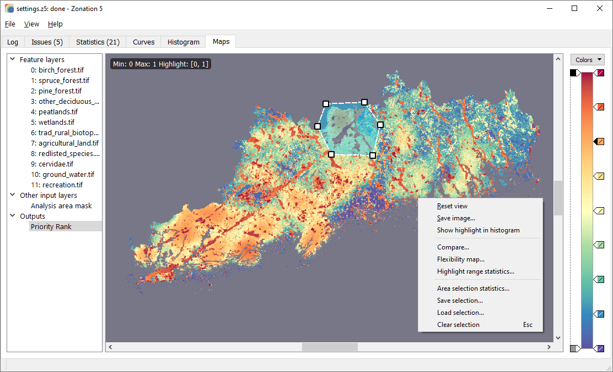
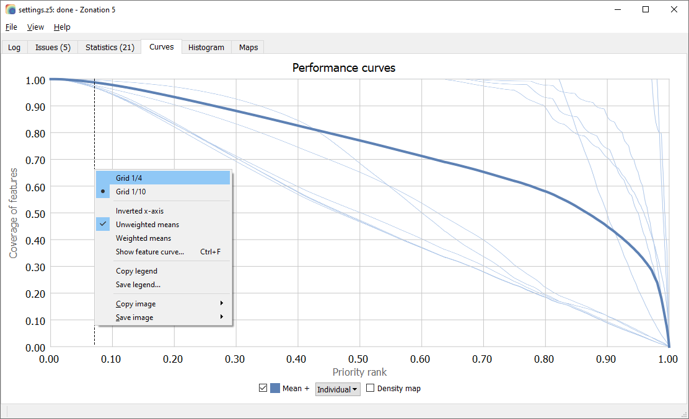

# Zonation 5

Zonation 5 is a spatial prioritization software that can be used to identify priority areas to support conservation planning, land use planning, ecological impact avoidance and other similar tasks. The software uses spatial raster data on the distributions of individual biodiversity features (species, habitats, ecosystem services etc.) to identify which locations in a landscape are most important for retaining biodiversity. Zonation can account for local habitat quality and ecological connectivity together with costs, threats and different land tenure, thus providing a quantitative method for spatial planning that enhances the persistence of biodiversity in the long term.

Zonation 5 is arguably the most powerful approach to spatial priority ranking currently available. The software is computationally highly efficient and straightforward to use. With suitable combinations of data and analysis setups, many different analytical needs can be answered. Please see the Zonation 5 manual for further information.

[Publications](publications.md)

## Screenshots

*Zonation 5 maps tab showing a priority rank map*

*Zonation 5 curves tab showing performance curves*

## Download Zonation 5 v2.3

[Release notes](https://github.com/zonationteam/Zonation5/releases/latest)

[Windows installer](https://github.com/zonationteam/Zonation5/releases/latest/download/Zonation5_Windows.zip)

[Linux AppImage](https://github.com/zonationteam/Zonation5/releases/latest/download/Zonation5_Linux.zip)

[Apptainer definition file](https://github.com/zonationteam/Zonation5/releases/latest/download/Zonation5.def)

[Manual and example setups](https://github.com/zonationteam/Zonation5/releases/download/v2.0/manual_and_example_setups.zip)

See the manual for installation instructions.

## License
Zonation 5 is distributed as is, freely under [GNU General Public License (GPL) version 3 (#GNUGPL) (#GNUGPLv3) license.](https://www.gnu.org/licenses/gpl-3.0.html)

[Credits](credits.md)

