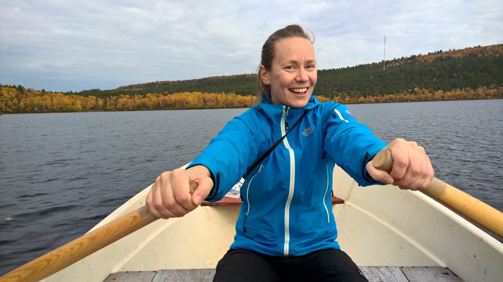

Heini Kujala is a PI and University Researcher at Finnish Natural History Museum (LUOMUS), based in Helsinki, Finland. She works with a variety of spatial conservation optimisation problems, spanning from reserve network design to cost-efficient management and biodiversity offsetting. Heini has been involved in the development, testing and teaching of the Zonation software since 2005.
