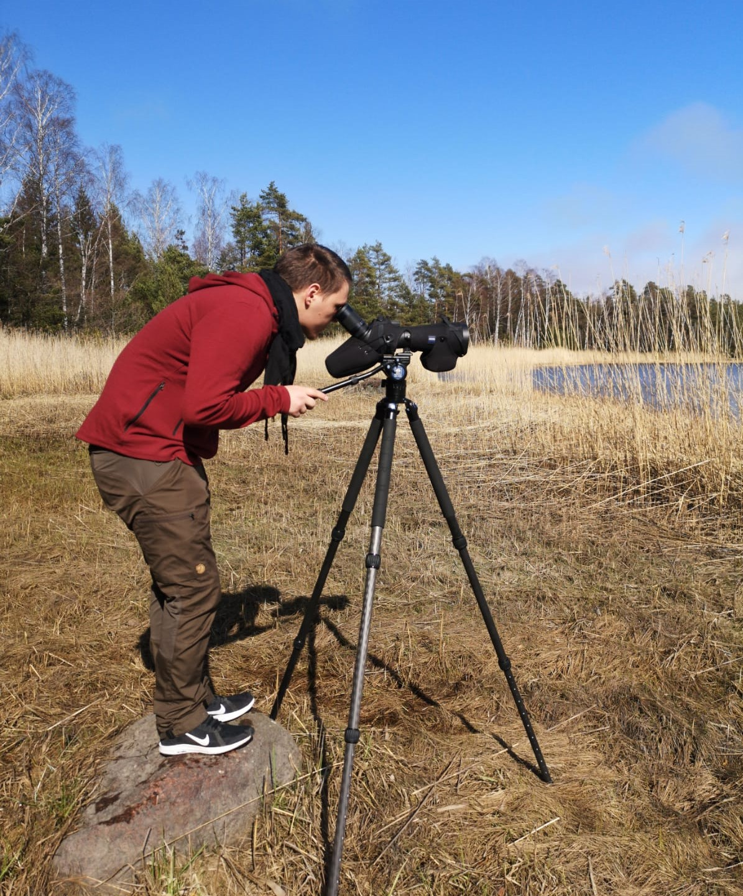

Joel Jalkanen, PhD, ecologist, is a post-doc researcher at the Finnish Museum of Natural History. His previous studies have focused on applying Zonation analyses in urban areas and in real-life land-use planning cases. So, when it comes to Zonation, he is mainly interested in the applicability, usability, and usefulness of the software and its tools for the end-users.

[University of Helsinki Research Portal](https://researchportal.helsinki.fi/en/persons/joel-jalkanen)
